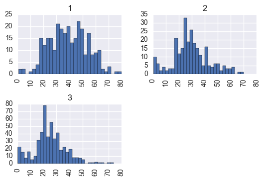
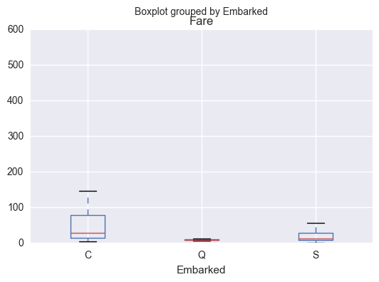
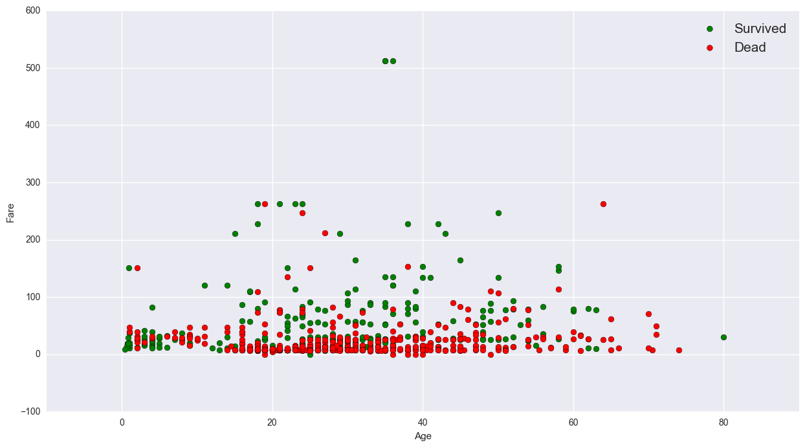

# TITANIC PROJECT 
### Using Python

### PYTHON LIBRARIES


```python
# Data Analysis and Wrangling
import pandas as pd
import numpy as np
import random as rnd
import re

# Data Visualization
import seaborn as sns
import matplotlib.pyplot as plt
%matplotlib inline

# Machine Learning
from sklearn.linear_model import LogisticRegression
from sklearn.svm import SVC, LinearSVC
from sklearn import cross_validation
from sklearn import svm
from sklearn.ensemble import RandomForestClassifier, VotingClassifier , GradientBoostingClassifier
from sklearn.neighbors import KNeighborsClassifier
from sklearn.naive_bayes import GaussianNB
from sklearn.linear_model import Perceptron
from sklearn.linear_model import SGDClassifier
from sklearn.tree import DecisionTreeClassifier
from sklearn.feature_selection import SelectKBest, f_classif
```

### DATA IDENTIFICATION


```python
# Import Titanic Data
train = pd.read_csv('train.csv')
test = pd.read_csv('test.csv')
data = pd.concat([train, test])
data = data.reindex_axis(['PassengerId','Survived','Pclass','Name','Sex','Age','SibSp',
                          'Parch', 'Ticket','Fare','Cabin','Embarked'], axis=1)
```


```python
### Analyze by describing data
# Pandas also helps describe the datasets answering following questions early in our project.
print(data.columns.values)
```

    ['PassengerId' 'Survived' 'Pclass' 'Name' 'Sex' 'Age' 'SibSp' 'Parch'
     'Ticket' 'Fare' 'Cabin' 'Embarked']
    

## DATA EXPLORATION

### VARIABLES IDENTIFICATION


```python
#Check current data type:
data.dtypes
```


    PassengerId      int64
    Survived       float64
    Pclass           int64
    Name            object
    Sex             object
    Age            float64
    SibSp            int64
    Parch            int64
    Ticket          object
    Fare           float64
    Cabin           object
    Embarked        object
    dtype: object


Categorical Features:
    # Categorical: Survived, Sex, Embarked
    # Ordinal: Pclass

Numerical Features:
    # Continous: Age, Fare
    # Discrete: SibSp, Parch

```python
# Curiosity: What would have been the price of the tickets in today's money? 
# Taking into account inflation, the price would have increased by about 106 times.
Today_money = data["Fare"].apply(lambda Fare: 106 * Fare)
Today_money.round().head(10)
```


    0     768.0
    1    7556.0
    2     840.0
    3    5629.0
    4     853.0
    5     897.0
    6    5497.0
    7    2234.0
    8    1180.0
    9    3188.0
    Name: Fare, dtype: float64


### MISSING VALUES TREATMENT


```python
# Checking Missing Values
train.info()
print('_'*40)
test.info()
```

    <class 'pandas.core.frame.DataFrame'>
    RangeIndex: 891 entries, 0 to 890
    Data columns (total 12 columns):
    PassengerId    891 non-null int64
    Survived       891 non-null int64
    Pclass         891 non-null int64
    Name           891 non-null object
    Sex            891 non-null object
    Age            714 non-null float64
    SibSp          891 non-null int64
    Parch          891 non-null int64
    Ticket         891 non-null object
    Fare           891 non-null float64
    Cabin          204 non-null object
    Embarked       889 non-null object
    dtypes: float64(2), int64(5), object(5)
    memory usage: 83.6+ KB
    ________________________________________
    <class 'pandas.core.frame.DataFrame'>
    RangeIndex: 418 entries, 0 to 417
    Data columns (total 11 columns):
    PassengerId    418 non-null int64
    Pclass         418 non-null int64
    Name           418 non-null object
    Sex            418 non-null object
    Age            332 non-null float64
    SibSp          418 non-null int64
    Parch          418 non-null int64
    Ticket         418 non-null object
    Fare           417 non-null float64
    Cabin          91 non-null object
    Embarked       418 non-null object
    dtypes: float64(2), int64(4), object(5)
    memory usage: 36.0+ KB
    


```python
# Confirming Missing Values - Train data
train.apply(lambda x: sum(x.isnull()),axis=0)
```


    PassengerId      0
    Survived         0
    Pclass           0
    Name             0
    Sex              0
    Age            177
    SibSp            0
    Parch            0
    Ticket           0
    Fare             0
    Cabin          687
    Embarked         2
    dtype: int64


```python
# Confirming Missing Values - Test data
test.apply(lambda x: sum(x.isnull()),axis=0)
```


    PassengerId      0
    Pclass           0
    Name             0
    Sex              0
    Age             86
    SibSp            0
    Parch            0
    Ticket           0
    Fare             1
    Cabin          327
    Embarked         0
    dtype: int64


# Total Missing Data:

Train (891 records):
    # Age      = 177 = 19.86%
    # Cabin    = 687 = 77.10%
    # Embarked = 2   = 0.22%

Test (418 records):
    # Age   = 86     = 20.57%
    # Cabin = 327    = 78.23%
    # Fare  = 1      = 0%

The number of 'Cabin' missing values is very high ~78% from both training and test datasets. 
Prediction of these values might bring misleading values. 
### VARIABLES ANALYSE
Categorical Features:
    # Categorical: Survived, Sex, Embarked
    # Ordinal: Pclass

Numerical Features:
    # Continous: Age, Fare
    # Discrete: SibSp, Parch

```python
# Checking Struture of Train and Test Dataset
[train.describe().round(), test.describe().round()]
```


    [       PassengerId  Survived  Pclass    Age  SibSp  Parch   Fare
     count        891.0     891.0   891.0  714.0  891.0  891.0  891.0
     mean         446.0       0.0     2.0   30.0    1.0    0.0   32.0
     std          257.0       0.0     1.0   15.0    1.0    1.0   50.0
     min            1.0       0.0     1.0    0.0    0.0    0.0    0.0
     25%          224.0       0.0     2.0    NaN    0.0    0.0    8.0
     50%          446.0       0.0     3.0    NaN    0.0    0.0   14.0
     75%          668.0       1.0     3.0    NaN    1.0    0.0   31.0
     max          891.0       1.0     3.0   80.0    8.0    6.0  512.0,
            PassengerId  Pclass    Age  SibSp  Parch   Fare
     count        418.0   418.0  332.0  418.0  418.0  417.0
     mean        1100.0     2.0   30.0    0.0    0.0   36.0
     std          121.0     1.0   14.0    1.0    1.0   56.0
     min          892.0     1.0    0.0    0.0    0.0    0.0
     25%          996.0     1.0    NaN    0.0    0.0    NaN
     50%         1100.0     3.0    NaN    0.0    0.0    NaN
     75%         1205.0     3.0    NaN    1.0    0.0    NaN
     max         1309.0     3.0   76.0    8.0    9.0  512.0]


```python
# Table with Survived by Pclass, Embarked and Sex
a = data[['Pclass', 'Survived']].groupby(['Pclass'], as_index=False).mean().sort_values(by='Survived', ascending=False)
b = data[['Embarked', 'Survived']].groupby(['Embarked'], as_index=False).mean().sort_values(by='Survived', ascending=False)
c = data[['Sex', 'Survived']].groupby(['Sex'], as_index=False).mean().sort_values(by='Survived', ascending=False)
Surstats = pd.concat ([a,b,c],axis =1)
Surstats
```


<div>
<table border="1" class="dataframe">
  <thead>
    <tr style="text-align: right;">
      <th></th>
      <th>Pclass</th>
      <th>Survived</th>
      <th>Embarked</th>
      <th>Survived</th>
      <th>Sex</th>
      <th>Survived</th>
    </tr>
  </thead>
  <tbody>
    <tr>
      <th>0</th>
      <td>1</td>
      <td>0.629630</td>
      <td>C</td>
      <td>0.553571</td>
      <td>female</td>
      <td>0.742038</td>
    </tr>
    <tr>
      <th>1</th>
      <td>2</td>
      <td>0.472826</td>
      <td>Q</td>
      <td>0.389610</td>
      <td>male</td>
      <td>0.188908</td>
    </tr>
    <tr>
      <th>2</th>
      <td>3</td>
      <td>0.242363</td>
      <td>S</td>
      <td>0.336957</td>
      <td>NaN</td>
      <td>NaN</td>
    </tr>
  </tbody>
</table>
</div>


The outcome tells us that only 19% of men survived, and only 26% of womans died. Also interesting is that 63% of the survival percentage are from 1st class, 47% from 2nd class and only 24% from 3rd class.

```python
# Analysing Variables Distribution
data.hist(column="Fare",by="Pclass",bins=30)
```


    array([[<matplotlib.axes._subplots.AxesSubplot object at 0x00000000139D8F98>,
            <matplotlib.axes._subplots.AxesSubplot object at 0x0000000013C5D908>],
           [<matplotlib.axes._subplots.AxesSubplot object at 0x0000000014020438>,
            <matplotlib.axes._subplots.AxesSubplot object at 0x0000000014081978>]], dtype=object)


```python
data.hist(column="Age",by="Pclass",bins=30)
```


    array([[<matplotlib.axes._subplots.AxesSubplot object at 0x0000000014810A90>,
            <matplotlib.axes._subplots.AxesSubplot object at 0x00000000145FB630>],
           [<matplotlib.axes._subplots.AxesSubplot object at 0x00000000149BD0B8>,
            <matplotlib.axes._subplots.AxesSubplot object at 0x0000000014AA36A0>]], dtype=object)





```python
data.boxplot(column="Age",by="Pclass")
```


    <matplotlib.axes._subplots.AxesSubplot at 0x14c99c88>


```python
data.boxplot(column="Fare",by="Embarked")
```


    <matplotlib.axes._subplots.AxesSubplot at 0x149cb4e0>





```python
plt.figure(figsize=(15,8))
ax = plt.subplot()
ax.scatter(data[data['Survived']==1]['Age'],data[data['Survived']==1]['Fare'],c='green',s=40)
ax.scatter(data[data['Survived']==0]['Age'],data[data['Survived']==0]['Fare'],c='red',s=40)
ax.set_xlabel('Age')
ax.set_ylabel('Fare')
ax.legend(('Survived','Dead'),scatterpoints=1,loc='upper right',fontsize=15,)
```


    <matplotlib.legend.Legend at 0x15696f98>





## FEATURE ENGINEERING

###  VARIABLE CREATION & TRANSFORMATION


```python
# Creating the variable 'Title' from 'Name'
data['Title'] = data['Name'].map(lambda name: name.split(',')[1].split('.')[0].strip())

data["Title"] = data["Title"].apply(lambda x: "Master" if re.search("Master",x) else x)
data["Title"] = data["Title"].apply(lambda x: "Miss" if re.search("Miss|Mlle|Lady",x) else x)
data["Title"] = data["Title"].apply(lambda x: "Mrs" if re.search("Mrs|Mme|Countess|Ms|Dona",x) else x)
data["Title"] = data["Title"].apply(lambda x: "Mr" if not re.search("Miss|Mrs|Master",x) else x)

data['Title'] = data['Title'].apply(lambda x: 1 if x=="Master" else 2 if x=="Miss" else 3 if x=="Mrs" else 4)
```


```python
# Creating the variable 'Family' from 'SibSp' and 'Parch' (passeger plus husband/wife and kids) 
data["Family"] = data["SibSp"] + data["Parch"] + 1 

data['Family'] = data['Family'].apply(lambda x: 'Single' if x==1 else 'Big' if x>=5 else 'Medium') 
data['Family'] = data['Family'].apply(lambda x: 1 if x=='Single' else 2 if x=='Medium' else 3)
```


```python
# Transformation of 'Sex' Variable
data['Sex'] = data['Sex'].apply(lambda x: 1 if x=="female" else 0)
```


```python
# Transformation of 'Embarked' Variable
data['Embarked'] = data['Embarked'].apply(lambda x: 1 if x=="S" else 2 if x=="C" else 3 if x=="Q" else 0)
```


```python
# Transformation of 'Fare' Variable into classes
data['Fare'] = data['Fare'].apply(lambda x: 'cheap' if x<=50 else 'expensive' if x>=200 else 'medium') 
data['Fare'] = data['Fare'].apply(lambda x: 1 if x=='cheap' else 3 if x=='expensive' else 2)
```

### MISSING VALUES TREATMENT


```python
# Treating Missing Values - Fare
data["Fare"].fillna(value=data["Fare"].median()).head(1)
```


    0    1
    Name: Fare, dtype: int64


```python
# Treating Missing Values - Embarked
data["Embarked"].fillna(value=data["Embarked"].median()).head(1)
```


    0    1
    Name: Embarked, dtype: int64


```python
# Treating Missing Values - Age
data['Age'] = data['Age'].apply(lambda x: 'child' if x<=17 else 'adult' if x>=30 else 'young') 
```


```python
data["Age"][data["Title"] == 1] = data["Age"].fillna('child')
data["Age"][data["Title"] == 2] = data["Age"].fillna('child')
data["Age"][data["Title"] == 3] = data["Age"].fillna('adult')
data["Age"][data["Title"] == 4] = data["Age"].fillna('adult')

data['Age'] = data['Age'].apply(lambda x: 1 if 'child' else 2 if 'young' else 3) 
```

    C:\Users\Pedro\Anaconda2\lib\site-packages\ipykernel\__main__.py:1: SettingWithCopyWarning: 
    A value is trying to be set on a copy of a slice from a DataFrame
    
    See the caveats in the documentation: http://pandas.pydata.org/pandas-docs/stable/indexing.html#indexing-view-versus-copy
      if __name__ == '__main__':
    C:\Users\Pedro\Anaconda2\lib\site-packages\ipykernel\__main__.py:2: SettingWithCopyWarning: 
    A value is trying to be set on a copy of a slice from a DataFrame
    
    See the caveats in the documentation: http://pandas.pydata.org/pandas-docs/stable/indexing.html#indexing-view-versus-copy
      from ipykernel import kernelapp as app
    C:\Users\Pedro\Anaconda2\lib\site-packages\ipykernel\__main__.py:3: SettingWithCopyWarning: 
    A value is trying to be set on a copy of a slice from a DataFrame
    
    See the caveats in the documentation: http://pandas.pydata.org/pandas-docs/stable/indexing.html#indexing-view-versus-copy
      app.launch_new_instance()
    C:\Users\Pedro\Anaconda2\lib\site-packages\ipykernel\__main__.py:4: SettingWithCopyWarning: 
    A value is trying to be set on a copy of a slice from a DataFrame
    
    See the caveats in the documentation: http://pandas.pydata.org/pandas-docs/stable/indexing.html#indexing-view-versus-copy
    

## MODELLING DATA


```python
# Confirming inesxistance of missing values 
# The variable Cabin will be ignored because of the high number of missing values (~77%).
data.apply(lambda x: sum(x.isnull()),axis=0)
```


    PassengerId       0
    Survived        418
    Pclass            0
    Name              0
    Sex               0
    Age               0
    SibSp             0
    Parch             0
    Ticket            0
    Fare              0
    Cabin          1014
    Embarked          0
    Title             0
    Family            0
    dtype: int64


```python
# Select predictors array
predictors = ["Sex","Title","Pclass","Fare","Embarked","Age","Family"]
```


```python
# Isolate the test and train variables
train_model = data[0:891].copy()
test_model = data[891:].copy()
```


```python
# Select the train and test features values
train_model.features = train_model[predictors].values
test_model.features = test_model[predictors].values
```


```python
# Feature selection
target = train_model["Survived"].values
k = train_model.features.shape[1]
selector = SelectKBest(f_classif, k=k)
selector.fit(train_model.features, target)
scores = -np.log10(selector.pvalues_)
print(scores)
```

    [ 68.85199425  49.94207413  24.59567142  16.08730233   2.63150678
              nan   2.93422191]
    

    C:\Users\Pedro\Anaconda2\lib\site-packages\sklearn\feature_selection\univariate_selection.py:113: UserWarning: Features [5] are constant.
      UserWarning)
    


```python
kfold_cv = cross_validation.KFold(train_model.shape[0], n_folds=3, random_state=1)

log_reg = LogisticRegression(random_state=1)
scores = cross_validation.cross_val_score(log_reg, train_model.features, target, cv=kfold_cv)
print("Accuracy: %0.3f (+/- %0.2f) [%s]" % (scores.mean()*100, scores.std()*100, 'LGR'))

svc = svm.SVC(kernel='linear', C=1.0, probability=True)
scores = cross_validation.cross_val_score(svc, train_model.features, target, cv=kfold_cv)
print("Accuracy: %0.3f (+/- %0.2f) [%s]" % (scores.mean()*100, scores.std()*100, 'SVC'))

rfc = RandomForestClassifier(random_state=1, n_estimators=50, min_samples_split=4, min_samples_leaf=2)
scores = cross_validation.cross_val_score(rfc, train_model.features, target, cv=kfold_cv)
print("Accuracy: %0.3f (+/- %0.2f) [%s]" % (scores.mean()*100, scores.std()*100, 'RFC'))

gbc = GradientBoostingClassifier(random_state=1, n_estimators=25, max_depth=3)
scores = cross_validation.cross_val_score(gbc, train_model.features, target, cv=kfold_cv)
print("Accuracy: %0.3f (+/- %0.2f) [%s]" % (scores.mean()*100, scores.std()*100, 'GBC'))

vtc = VotingClassifier(estimators=[('RFC', rfc),('GBC',gbc)], voting='soft')
scores = cross_validation.cross_val_score(vtc, train_model.features, target, cv=kfold_cv)
print("Accuracy: %0.3f (+/- %0.2f) [%s]" % (scores.mean()*100, scores.std()*100, 'Ens'))

```

    Accuracy: 79.910 (+/- 0.42) [LGR]
    Accuracy: 79.237 (+/- 1.41) [SVC]
    Accuracy: 83.277 (+/- 1.30) [RFC]
    Accuracy: 82.828 (+/- 1.20) [GBC]
    Accuracy: 82.267 (+/- 1.11) [Ens]
    


```python
# Create a prediction for test dataset
vtc.fit(train_model.features, target)
prediction = vtc.predict(test_model.features) 
print(prediction)
```

    [ 0.  1.  0.  0.  1.  0.  1.  0.  1.  0.  0.  0.  1.  0.  1.  1.  0.  0.
      0.  1.  0.  1.  1.  0.  1.  0.  1.  0.  0.  0.  0.  0.  1.  1.  0.  0.
      0.  0.  0.  0.  0.  0.  0.  1.  1.  0.  0.  0.  1.  1.  0.  0.  1.  1.
      0.  0.  0.  0.  0.  1.  0.  0.  0.  1.  1.  1.  1.  0.  0.  1.  1.  0.
      0.  0.  1.  0.  0.  1.  0.  1.  1.  0.  0.  0.  0.  0.  1.  0.  1.  1.
      1.  0.  1.  0.  0.  0.  1.  0.  0.  0.  1.  0.  0.  0.  1.  0.  0.  0.
      0.  0.  0.  1.  1.  1.  1.  0.  0.  0.  0.  1.  1.  0.  1.  0.  0.  0.
      0.  1.  0.  0.  0.  0.  0.  0.  0.  0.  0.  0.  0.  0.  0.  1.  0.  0.
      0.  0.  0.  0.  0.  0.  1.  0.  0.  1.  0.  0.  1.  0.  0.  1.  1.  1.
      1.  0.  0.  1.  0.  0.  1.  0.  0.  0.  0.  0.  0.  1.  1.  0.  1.  1.
      0.  0.  1.  0.  1.  0.  1.  0.  0.  0.  0.  0.  1.  0.  1.  0.  1.  0.
      0.  1.  1.  1.  0.  1.  0.  0.  1.  0.  1.  0.  0.  0.  0.  1.  0.  0.
      1.  0.  1.  0.  1.  0.  1.  0.  1.  1.  0.  1.  0.  0.  0.  1.  0.  0.
      0.  0.  0.  0.  1.  1.  1.  1.  0.  0.  1.  0.  1.  0.  1.  1.  1.  0.
      0.  0.  0.  0.  0.  0.  1.  0.  0.  0.  1.  0.  0.  0.  0.  0.  0.  0.
      0.  0.  1.  1.  0.  1.  0.  0.  0.  0.  0.  1.  1.  1.  0.  0.  0.  0.
      0.  0.  0.  1.  0.  0.  0.  0.  1.  0.  0.  0.  0.  0.  0.  0.  1.  1.
      0.  1.  0.  1.  0.  0.  0.  1.  1.  1.  0.  0.  0.  0.  0.  0.  0.  0.
      1.  0.  1.  0.  0.  0.  1.  0.  0.  1.  0.  0.  0.  0.  0.  1.  0.  0.
      0.  1.  1.  0.  0.  1.  0.  1.  1.  0.  0.  0.  0.  0.  1.  0.  0.  1.
      0.  1.  1.  0.  1.  0.  0.  0.  1.  0.  0.  1.  0.  0.  1.  1.  0.  0.
      0.  0.  0.  0.  1.  1.  0.  1.  0.  0.  0.  0.  0.  1.  1.  0.  0.  1.
      0.  1.  0.  0.  1.  0.  1.  0.  0.  0.  0.  0.  1.  0.  1.  1.  0.  0.
      1.  0.  0.  1.]
    


```python
# Create a data frame with two columns: PassengerId & Survived. Survived contains your predictions
PassengerId =np.array(test["PassengerId"]).astype(int)
solution = pd.DataFrame(prediction, PassengerId, columns = ["Survived"])
```


```python
# Write your solution to a csv file with the name my_solution.csv
solution.to_csv("titanic_sol_py.csv", index_label = ["PassengerId"])
print("Project Done!!!!!!")
```

    Project Done!!!!!!
    
